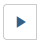

# Building a Data System with Airflow

## URL's disponibles en la App

* 1 - http://127.0.0.1:8080   Webserver de Apache Airflow
* 2 - http://127.0.0.1:5000   Webserver Flask para plots
* 3 - http://127.0.0.1:2222   Webserver PGAdmin para DB Postgres (no es el server que usa Airflow)
* 4 - http://127.0.0.1:5555 Webserver Flower para dashboard interactivo con tareas de Airflow

#### Credenciales de acceso a los servicios

* - <b>Webserver de Apache Airflow: </b> User: airflow   Pass: airflow
* - <b>Webserver Flask para plots: </b> Sin credenciales
* - <b>Webserver PGAdmin: </b> User: postgres  Pass: 12345678
* - <b>Webserver Flower: </b> Sin credenciales

#### Importante
Si quiere subir esta app a algun repositorio, debera primero instalar los hooks de pre-commit, asi podra tener una validacion
Ejecute en el directorio raiz ```poetry install``` & ```poetry run pre-commit install```


The goal of this practice is to build a system that logs the daily price of different stocks

## Modo de uso

1° Deberá clonar el directorio remoto git de la siguiente manera<p>
```git clone https://github.com/itba-cloud-data-engineering/itba-cde-tpf-python-applications-marcelogramma.git```<p>

2° Ingresar al directorio clonado
```cd  itba-cde-tpf-python-applications-marcelogramma```

Dar permisos a los siguientes directorios

```sudo chmod -R 777 app-python/src/static/```<p>
```sudo chmod -R 777 app-python/tests/logs/```<p>
```sudo chmod -R 777 app-python/tests/.pytest_cache/```<p>
```sudo chmod -R 777 app-python/data/```<p>

3° Ejecutar el siguiente comando
```docker-compose up```   ( puede agregar el modificador -d al final para no ver la corrida)
Si recibe un error similar a ***docker-compose.yaml - invalid argument in service airflow-cli: Profile***
[Actualice docker-compose a la version 1.29.2 o superior](https://docs.docker.com/compose/install/)

4° Una vez que finalizo el up de todos los contenedores, tendremos la aplicación operativa. En este punto podemos ingresar a la url http://127.0.0.1:2222. Una vez dentro de la UI del PGAdmin, debemos agregar un nuevo server, haciendo click en "Add New Server" con los siguientes datos:<p>
Pestaña General: Name: "a elección"

Pestaña Connection: Host: db_postgres

&emsp;&emsp;&emsp;&emsp;&emsp;&emsp;&emsp;&emsp;&emsp;&emsp;&ensp;Port: 5432

&emsp;&emsp;&emsp;&emsp;&emsp;&emsp;&emsp;&emsp;&emsp;&emsp;&ensp;Maintenance Database: postgres

&emsp;&emsp;&emsp;&emsp;&emsp;&emsp;&emsp;&emsp;&emsp;&emsp;&ensp;Username: postgres

&emsp;&emsp;&emsp;&emsp;&emsp;&emsp;&emsp;&emsp;&emsp;&emsp;&ensp;Password: 12345678<p>

En el explorador de la izquierda, podremos ver un árbol y si lo exploramos encontraremos nuestra Base de Datos llamada "prices_from_agm". Aprovechar para explorarla y analizar la misma.

5° En este momento podemos verificar con el comando ```docker-compose ps``` que todos nuestros contenedores esten operativos (healthy). 
Ahora ejecutamos [poetry](https://python-poetry.org/docs/), que usaremos luego para diversas corridas, con el comando ```poetry install```
En este punto podemos correr un test unitario de pytest de la siguiente manera.
Desde la misma terminal, situado en el mismo directorio raiz, donde lanzamos la aplicación con el comando docker-compose up, ejecutar las siguientes lineas:

```sudo chmod -R 777 app-python/tests/logs/pytest.log```<p>

```sudo ./airflow.sh bash -c " cd /opt/airflow/tests/ && pytest data/dags-test/ -W ignore::DeprecationWarning -v"```

No obviar el punto(.) inicial ni las comillas finales. 
Esto levantara un nuevo container con los módulos necesarios dentro del entorno de airflow, el cual esta capacitado para ejecutar dos test (aggregation_plot y generation_plot), que serán explicados mas adelante, en los puntos 7.1 y 7.2. 
Por el momento solo podemos adelantar que dentro del directorio  /tests/logs, tendremos un archivo llamado pytest.log, donde se loguea los tests de toda la aplicación . Podremos ver el resultado de este ultimo test, mas otros test que se ejecutan durante la instalación de la aplicación, que explicaremos en los puntos 7.1 y 7.2

6° Ahora podemos ingresar a la UI de Airflow, en la url http://127.0.0.1:8080. En este punto veremos dos dags. Uno de ellos llamado "erease_old_files" y otro "prices_from_AGM"
El primer dag se ejecuta solo los día 1 de cada mes y busca dentro del directorio data, archivos JSON mas antiguos a 15 días y los borra
El segundo dag, es el que se encarga de consultar la api donde estan disponibles valores de negocio de cada empresa, en este caso Amazon, Google y Microsoft. Traer esa información, guardarla en una Base de Datos y luego generar un plot con la informacion semanal de apertura, cierre y volumen de cada empresa solo de los días hábiles. 
Estos dos dags se explicaran completamente en los puntos 5 y 6.

7° En este punto podemos hacer click sobre el dag prices_from_AGM, y ver el grafo en forma de grafica como así también las tareas que realiza y hacer una prueba. Para esto, sobre la derecha en el botón , y luego en Trigger DAG. Con esto ejecutamos el dag con sus respectivas tareas.

8° Nos dirigimos al Server Flask para Plots  (http://127.0.0.1:5000), y podremos ver 3 plots, donde se muestras los valores de cada una de las empresas para open, close y volume en el lapso de una semana para los días laborales.


#### Explicación de como se resolvió cada punto

#### Instructions

<b>1. Setup Airflow using the official `docker-compose` YAML file. This can be obtained here:</b>
    https://airflow.apache.org/docs/apache-airflow/stable/start/docker.html#docker-compose-yaml
    
 Este YAML ha sufrido varias modificaciones para poder adecuarlo a las necesidades de este desafió.
 Las modificaciones que se hicieron fueron las siguientes:<p></p>
&ensp;&ensp;- se cambio a la versión apache/airflow:2.2.1<p></p>
&ensp;&ensp;- se agregaron módulos matplotlib pytest<p></p>
&ensp;&ensp;- se agregaron y modificaron volúmenes dentro del entorno de Airflow<p></p>
&ensp;&ensp;- se agregaron directivas para crear distintos directorios para ser usados por el entorno<p></p>
&ensp;&ensp;- se agrego un container llamado web_pgadmin4 para administración de la Base de Datos por UI<p></p>
&ensp;&ensp;- se agrego un container llamado db_postgres donde se aloja la data extraída de la API y creación de reportes<p></p>
&ensp;&ensp;- se agrego un container llamado python_populator el cual se encarga de hacer el primer bulk de datos a la DB&ensp;&ensp;con toda la data de la API y también en el reside el [Server Flask](http://127.0.0.1:5000) para exponer los reportes graficos<p></p>
&ensp;&ensp;- se agrego un container llamado python_tester el cual corre una bateria de test durante la instalación de la app,&ensp;&ensp;todo el reporte de este container se puede ver en la ruta ./app-python/tests/logs/<p></p>
    

<b>2. Create another database in the Postgres used by Airflow to store the stocks data.</b>

Se crea un container llamado db_postgres donde residirá la data extraída de las API's y desde donde se consultara para la realizacion de los plots diarios.


<b>3. Develop the data model to store the daily stock data (symbol, date, open, high, low, close) using SQLAlchemy's declarative base. Then create the tables in the DB.</b>

***Importante***

Para todo lo desarrollado en los puntos siguientes, se creo un archivo llamado "configinc.py" el cual tiene la información necesaria para ser usado por los distintos scripts de la aplicación. Estos son como definición del símbolo, definición del endpoint API, Key de la API, definición de la conexión  a la base de datos, etc.

Se agrego al docker-compose.yaml un container llamado python_populator, el cual corre desde dentro de si mismo primero el script models. py, el cual crea la base de datos y create_tables.py que crea la tabla en la Base de Datos. Seguido de este ejecuta el script PopulatorDB.py, el cual consulta a las API's, una consulta por cada símbolo (AMZN, GOOG y MSFT). Esta data la baja a un archivo JSON identificado como "symbol".json dentro del directorio ./app-python/src/. Luego se ejecuta una función que recorre los archivos creados e inserta la data en la Base de Datos.

<b>4. Create a Python class, similar to the `SqLiteClient` of the practical Airflow coursework, in order to connect with the Postgres DB. You should implement the same methods present in the `SqLiteClient`. Bonus: Try to write a parent/base DB API class and make the `SqLite` and Postgres client inherit from it.</b>

Hecho en el punto anterior

<b>5. Develop a DAG that obtains the price information of Google (GOOG), Microsoft (MSFT) and Amazon (AMZN) and then inserts the data in the database using the Python class developed in the previous point.
   For this we suggest using the following API:
   https://www.alphavantage.co/
   The Python files that define the DAGs should be placed in the `dags` directory previosly mentioned.</b>
   
   En este punto se desarrollaron dos DAG's, uno llamado "erease_old_files" y otro prices_from_AGM"
   
   "erease_old_files" se ejecuta el día primero de cada mes y mediante un BashOperator corre un script en bash que busca en el directorio ./app-python/data todos los archivos .json con un tiempo de creacion superior a 15 dias y los elimina. En el siguiente dag se explica de donde salen estos archivos json.

"prices_from_AGM", este es el dag principal de la aplicación, el cual se ejecuta todos los dias a las 03.00 am UTC. El mismo tiene definido 4 tareas, haciendo apoyo en PythonOperator. Tres de estas tareas son consultas a la API, cada una utilizando un symbolo distinto para poder asi, traer data por cada uno. Esta data es bajada a un archivo al cual se le agrega en el nombre del archivo la fecha del execute_date + symbolo.json. Quedando un archivo similar a este nombre "2021-11-15-GOOG.json". Estos archivos se guardan por un mes, y luego los mayores a 15 días de antigüedad son eliminados por el dag anteriormente explicado.

<b>6. Add another task the that depends on the first one that fetches data from the database of the last week and produces a plot of the value of each stock during said time period.</b>

Para este punto se creo una funciona llamada "_query_for_plots" dentro del script dummy_dag, la cual consulta la base de datos por la información de cada simbolo en el lapso de una semana, para los días laborables y conforma 3 plots distintos. Uno con la muestra del valor de apertura de cada símbolo, otro con el cierre y el ultimo con el volumen. Todos para el lapso de tiempo especificado.

<b>7. Add two unit tests runnable with [pytest](https://docs.pytest.org/) that can be run from the commandline:
    - One that tests the extraction. This refers to the formatting that takes place after the data is fetched from the API that is to be inserted in the DB. 
    - Another for the aggregation of the values used for plotting after they are extracted from the DB.</b>
  
  ***Importante***
  Estos test (2 scripts en total con varias funciones de test dentro) corren en forma automatica al instalar la aplicación. Los logs de estos test los podremos encontrar en el directorio ./app-python/tests/logs/pytest.log
   
  Punto 7.1:   Con ayuda de la herramienta pytest, al instalar la aplicación, en forma automática, corren varios tests definidos en los scripts dentro del directorio tests/core. Estos archivos son "test_api_core_status.py" y "test_db_operate.py". El primero testea parámetro de la API, como que responda con un 200 ok, y que tenga contenido valido la respuesta. Mientras que el segundo chequea operaciones básicas contra la base de datos, como crear una tabla, insertarle datos, consultarlos y borrar la tabla.
  
***Importante 2***

 Estos test (2 scripts en total con varias funciones de test dentro) corren al ejecutar la linea 
 ```./airflow.sh bash -c " cd /opt/airflow/tests/ && pytest data/dags-test/ -W ignore::DeprecationWarning -v"``` , comentada en puntos anteriores. Los logs de estos test los podremos encontrar en el directorio ./app-python/tests/logs/pytest.log
  
Punto 7.2: Siguiendo con el esquema del punto 7.1, los test definidos en los scipts "test_aggregation_data.py" y "test_dummy_dag.py", ejecutan una batería de tests que consisten:
El primero que calcular el AVG de cada simbolo, en el cierre, en el lapso semanal.
El segundo realiza la comprobación de la función que hace los plots y verifica que los pueda realizar correctamente.

<b>8. Implement a CI step using [GitHub Actions](https://docs.github.com/en/actions) to run the unit tests using `pytest` each time a commit is pushed to a branch in a PR. In case of failure the result should be visible in GitHub's merge request UI.</b>

Como ya en el punto anterior desarrolle test con pytest, en este punto desarrolle un test unitario que se ejecuta al realizar un push a git. Este test sencuentra en el directorio .github/workflows/ y el script es "api_test.yaml". Lo que hace este test, es verificar el correcto funcionamiento de la API al hacer un push al repositorio de Git

## Extras
Using the suggested `docker-compose` setup you can access the database using `airflow` as both busername and password in the following way:
```
$ sudo docker-compose exec airflow-webserver psql -h postgres
Password for user airflow: 
psql (11.13 (Debian 11.13-0+deb10u1), server 13.4 (Debian 13.4-4.pgdg110+1))
WARNING: psql major version 11, server major version 13.
         Some psql features might not work.
Type "help" for help.

airflow=# 
```

In the same way you can open a shell to work inside the Docker containers using:
```
sudo docker-compose exec airflow-webserver /bin/bash
```
This can be useful when creating the tables that will hold the data.

When connecting to the DB from inside the container you can use the default value of the `AIRFLOW__CORE__SQL_ALCHEMY_CONN` variable defined in the compose file.

## Bonus points

If you want to go an extra mile you can do the following:
* Add the configs for [Pylint](https://pylint.org/) and [black](https://black.readthedocs.io/en/stable/).
* Implement a CI step using [GitHub Actions](https://docs.github.com/en/actions) to run Pylint each time a commit is pushed to a branch in a PR.

Bonus.1 - Dentro del directorio raíz de la aplicación, encontraremos un script llamado ".pre-commit-config.yaml" el cual verifica mediante dos herramientas de code quality, la calidad del código. Se corre Black, para formatear el codigo y Pylint para verificar el codigo en busca de fallas y/o escrituras.

Bonus.2 - Situándonos en el directorio .github/workflows, encontraremos un script llamado "black_test.yaml", el cual realiza un test con la herramienta black, al directorio de app-python en el momento de solicitar un pull-request o PR. Esto nos garantiza en el momento de mergearlo a la rama principal, que nuestro codigo cumpla con los estandares de code quality.